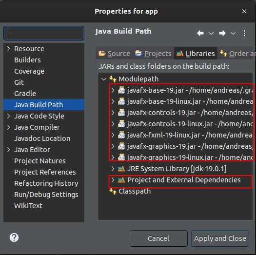

# Notes

* This project serves as a boilerplate for a JavaFX development setup based on Gradle and Eclipse using a module based approach
* It has been tested with OpenJDK 19.0.1, OpenJFX 19 , Gradle 7.6 and Eclipse 2022-12.

## Building and running on the command line

To build the project, make sure that gradle is in your `PATH` (the project does not currently contain gradle wrappers) and run

    $ gradle build
    Starting a Gradle Daemon (subsequent builds will be faster)
    
    > Configure project :app
    Project :app => 'javafxminimal' Java module
    
    BUILD SUCCESSFUL in 13s
    6 actionable tasks: 6 executed

To run the project, make sure that gradle is in your `PATH` (the project does not currently contain gradle wrappers) and run

    $ gradle run
    
    > Configure project :app
    Project :app => 'javafxminimal' Java module
    
    BUILD SUCCESSFUL in 6s
    4 actionable tasks: 2 executed, 2 up-to-date

## Building and running in Eclipse

* Launch Eclipse
* Choose "Import projects" ... => "Gradle" => "Existing Gradle Project"
* Enter the project root directory => "Next"
* Enter the installation directory of Gradle and the JDK => "Next"
* Validate the Gradle project structure - it should look like

     JavaFXminimal
       +---- JavaFXminimalApp

* Click "Finish"

Eclipse will now mark the `Main.java` file with compilation errors. To fix this:

* Mark the "JavaFXminimalApp" Project and choose "Build Path" => "Configure Build Path..." from the context menu
* Move the "Project and External Dependencies" library from "Classpath" to "Modulepath"

The build errors should now disappear since Eclipse can now find the compile time dependencies.

To run the application:
* Open the package containing the `Main.java` file, select it, and choose "Run" => "Java Application" from the context menu 
* You will see the following error:

    java.lang.module.FindException: Module javafx.graphics not found, required by javafxminimal

To fix this: 

* Mark the "app" Project and choose "Build Path" => "Configure Build Path..." from the context menu
* Open the "Project and External Dependencies" library and select all javafx modules
* Drag them up so that they are located directly in the "Modulepath" section afterwards:

**Note**: It seems that the modules can not be removed from the library, so the previous action is really a copy rather
than a move. However it seems that this does not have any side effects.

* Open the package containing the `Main.java` file, select it, and choose "Run" => "Java Application" from the context menu 
* The java application is now running.

**Note:** When new dependencies are added to the gradle build file, it is necessary to choose "Gradle" => "Refresh Gradle Project" from the Project's
context menu. Unfortunately the tweaks mentioned above then need to be redone, since the Module path setup is reverted (although it contains the additional dependencies).

Happy JavaFX Coding :-)
